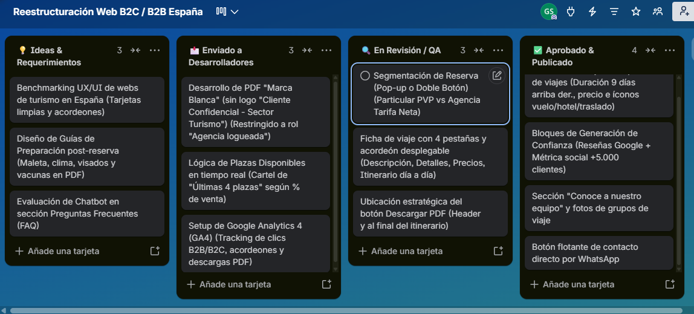

# Reestructuración Digital & Plataforma Turística (Empresa X)

**Gonzalo Rodriguez Spuch** — *Project Management / Product Ownership Portfolio Project* – 2026

---

## Table of Contents

- [0. Descargo de Responsabilidad (Disclaimer)](#0-descargo-de-responsabilidad-disclaimer)
- [1. Visión General del Proyecto (Project Overview)](#1-visión-general-del-proyecto-project-overview)
- [2. Objetivos del Proyecto (Project Goals)](#2-objetivos-del-proyecto-project-goals)
- [3. Estructura del Proyecto y Herramientas (Project Framework & Artifacts)](#3-estructura-del-proyecto-y-herramientas-project-framework--artifacts)
- [4. Resumen Ejecutivo (Executive Summary)](#4-resumen-ejecutivo-executive-summary)
- [5. Herramientas y Stack de Gestión (Tools & Stack)](#5-herramientas-y-stack-de-gestión-tools--stack)
- [6. Control de Contingencias y Riesgos](#6-control-de-contingencias-y-riesgos)
- [7. Project Charter & WBS: Reestructuración Web B2C/B2B](#-project-charter--wbs-reestructuración-web-b2cb2b---empresa-x)
- [8. Tablero de Gestión (Trello Kanban)](#-tablero-de-gestión-trello-kanban)

---

## 0. Descargo de Responsabilidad (Disclaimer)

Toda la información y documentación presentada en este repositorio ha sido **completamente anonimizada y modificada (Empresa X)** para proteger la confidencialidad comercial y los acuerdos de confidencialidad (NDA). Los requerimientos, estructuras y entregables no representan la totalidad de la operación real de la empresa y tienen como único fin demostrar la metodología de gestión de proyectos y diseño de producto.

---

## 1. Visión General del Proyecto (Project Overview)

Muchas empresas del sector turismo en España operan con sitios web y plataformas comerciales legacy que han quedado desactualizadas frente a las exigencias actuales del mercado digital. Con el tiempo, esto genera ineficiencias operativas, fricción en la experiencia de usuario (UX) e incapacidad para escalar el canal de ventas B2B con agencias y aliados comerciales.

Este proyecto aborda estos desafíos mediante un **framework integral de Project Management / Product Ownership** para liderar la reestructuración digital de la plataforma. El objetivo es estructurar la estrategia desde la investigación inicial hasta la planificación ágil de la ejecución, alineando los objetivos de negocio con el desarrollo técnico sobre WordPress.

Las soluciones y entregables desarrollados en este proyecto son de alto valor para:
* **Equipos Comerciales y de Ventas:** Al habilitar una arquitectura B2C para cliente final y un canal B2B estructurado para agencias asociadas.
* **Equipos de Desarrollo y UX/UI:** Al contar con un PRD (Documento de Requerimientos de Producto), historias de usuario y una WBS clara que elimina la ambigüedad en la fase de implementación.
* **Dirección y Project Managers:** Al proveer visibilidad total del alcance, plazos y flujo de trabajo a través de un tablero Kanban transparente.

---

## 2. Objetivos del Proyecto (Project Goals)

Este proyecto fue diseñado en torno a tres objetivos estratégicos orientados a profesionalizar la gestión del producto web y asegurar una ejecución predecible:

### 1. Definición de Alcance & Arquitectura de Información
* Investigar el mercado de turismo en España para identificar mejores prácticas de UX/UI.
* Consolidar los requerimientos funcionales y de negocio en un **PRD** estructurado en Notion.
* Diseñar la nueva arquitectura de información y la navegación del portal para canales B2C y B2B.

### 2. Planificación Estratégica & WBS (Estructura de Desglose de Trabajo)
* Desglosar el proyecto en módulos funcionales y entregables medibles a lo largo de un ciclo de 8 semanas.
* Mapear la **WBS** para coordinar los esfuerzos del equipo de desarrollo, diseño y analítica.
* Definir criterios de aceptación claros para el control de calidad (QA) antes de la puesta en producción.

### 3. Gestión Ágil & Medición de Rendimiento
* Estructurar el backlog y el flujo de trabajo en **Trello (Kanban)** para asegurar la transparencia del proceso de desarrollo.
* Diseñar el plan de medición de eventos en **Google Analytics 4 (GA4)** para evaluar la adopción del portal y el embudo de conversión.
* Establecer un modelo de gobernanza que garantice la entregabilidad dentro del presupuesto y plazos acordados.

---

## 3. Estructura del Proyecto y Herramientas (Project Framework & Artifacts)

La gestión y documentación de este proyecto se estructuró a través de un ecosistema de herramientas de Project Management para garantizar la trazabilidad, la colaboración fluida y la alineación entre las partes interesadas (Stakeholders) y el equipo técnico.

### Documentación Central (Notion)

Es el repositorio principal de conocimiento del proyecto donde se centralizó la estrategia y la definición funcional:
* **Project Charter:** Define la justificación del negocio, los objetivos estratégicos, el alcance inicial, las restricciones y los criterios de éxito de la reestructuración web.
* **PRD (Documento de Requerimientos de Producto):** Detalla las especificaciones funcionales B2C y B2B, los flujos de usuario, las historias de usuario (*User Stories*) y las reglas de negocio para el canal de agencias.
* **Arquitectura de Información (IA):** Mapeo de la navegación del sitio, jerarquía de páginas y mapas de experiencia de usuario (User Journeys).

### Estructura de Desglose de Trabajo (WBS)

Herramienta jerárquica utilizada para descomponer el proyecto a 8 semanas en bloques de trabajo gestionables:
* **Módulos Funcionales:** Investigación & Estrategia, Experiencia de Usuario (UX/UI), Desarrollo WordPress, Portal B2B, Integraciones y Calidad (QA).
* **Entregables Medibles:** Cada paquete de trabajo cuenta con criterios de aceptación claros y entregables definidos para eliminar la ambigüedad en la fase de desarrollo.

### Gestión Ágil de Flujos (Trello Kanban)

Tablero visual utilizado para la planificación y seguimiento del backlog de ejecución:
* **Flujo de Trabajo (Workflow):** Organizado en columnas de *Backlog, En Proceso (In Progress), En Revisión/QA (Review)* y *Completado (Done)*.
* **Asignación de Tareas:** Tarjetas de tareas derivadas de la WBS con etiquetas por nivel de prioridad, dependencias técnicas y listas de verificación (*Checklists*).

### Métricas & Control de Calidad (Google Analytics 4 & QA)

Plan de medición y trazabilidad diseñado para validar el rendimiento del nuevo portal:
* **Plan de Eventos GA4:** Mapeo de eventos personalizados para medir la conversión del embudo B2C y la adopción del portal B2B por parte de las agencias.
* **Matriz QA:** Lista de comprobación para pruebas funcionales, rendimiento *mobile* y validación de flujos comerciales antes de la puesta en producción.

---

## 4. Resumen Ejecutivo (Executive Summary)

Este proyecto proporciona una estructuración de Project Management / Product Ownership para la reestructuración digital de una empresa de turismo. La metodología aplicada permitió transformar un concepto web tradicional en un plan de producto ejecutable, transparente y orientado a la conversión B2C y B2B.

* **Definición de Alcance & Requerimientos:** Se estructuró un backlog integral a 8 semanas, logrando desglosar la reestructuración del portal en **6 módulos funcionales y más de 20 entregables clave** documentados en Notion.
* **Optimización de Canal B2B:** Se diseñó el flujo operativo para agencias de viajes asociadas, definiendo permisos por roles, visibilidad de tarifas netas y automatización de presupuestos en marca blanca para reducir la fricción comercial.
* **Gobierno de Proyecto & Priorización:** A través del tablero Kanban en Trello, se categorizaron y priorizaron las tareas por impacto/esfuerzo, estableciendo un flujo de trabajo claro (*Backlog, In Progress, QA, Done*) para coordinar al equipo de desarrollo técnico en WordPress.
* **Medición & Analítica Digital:** Se definió una matriz de trazabilidad de eventos en **Google Analytics 4 (GA4)** enfocado en medir la interacción del usuario, el embudo de reserva B2C y la adopción del portal por parte del canal B2B.
* **Criterios de Calidad (QA):** Se formularon listas de validación funcional y de rendimiento *responsive/mobile* para asegurar una transición fluida antes de la puesta en producción final.

Toda la estructura metodológica, el Project Charter, la WBS y las capturas de la gestión en Trello están disponibles para revisión en las secciones siguientes de este repositorio.

---

## 5. Herramientas y Stack de Gestión (Tools & Stack)

* **Documentación & PRD:** Notion (Estructuración de Project Charter, PRD, User Stories y WBS).
* **Gestión Ágil & Flujos:** Trello (Tablero Kanban para seguimiento de Backlog, Sprints y entregables).
* **CMS & E-commerce Target:** WordPress / WooCommerce (Arquitectura de información para B2C/B2B).
* **Analítica & Calidad:** Google Analytics 4 (GA4) para plan de medición de eventos y matriz de pruebas QA.

---
## 6. Control de Contingencias y Riesgos

Partiendo de la investigación inicial completada, se identificaron los principales cuellos de botella del proyecto y sus planes de acción para cumplir con las 8 semanas de plazo:

* **Dependencias y retrasos en IT (Bloqueos técnicos):** Si el equipo de desarrollo se atrasa en una funcionalidad base, se reasignan las prioridades en Trello para avanzar en tareas independientes (diseño, textos o estructura) sin congelar el proyecto.
* **Control de cambios de alcance:** Si surgen nuevas ideas o funcionalidades durante el desarrollo, no se incorporan sobre la marcha; se documentan en Notion para planificarlas en una Fase 2.
* **Tiempos de respuesta y aprobación:** Para evitar que la validación de los avances frene el flujo de trabajo, se fijaron ventanas de revisión de 48 horas con los stakeholders.

---

# ✈️ Project Charter & WBS: Reestructuración Web B2C/B2B - Empresa X

## 1. Resumen & Objetivo del Proyecto
Liderar la reestructuración integral del sitio web e-commerce de una empresa del sector turismo en España (Empresa X) sobre WordPress. El objetivo es optimizar la plataforma para responder a una doble dinámica comercial: captación directa de clientes particulares (B2C) y facilitación del canal de venta para agencias minoristas colaboradoras (B2B), incrementando la conversión y reduciendo la carga operativa mediante funciones de autoservicio y analítica avanzada (GA4).

## 2. Alcance del Proyecto (Alcance Funcional)
* **Visualización de Paquetes & UX:**
  * Rediseño de fichas de viajes limpias con badges de duración, precio e íconos de servicios (vuelo/hotel/traslado).
  * Ficha detallada con navegación por 4 pestañas: Descripción, Detalles, Precios e Itinerario.
  * Sistema de itinerarios en formato desplegable (acordeón día por día), mapas de ruta y galería.
* **Segmentación B2C / B2B:**
  * Flujo diferenciado de reserva/login para Cliente Particular (PVP) vs. Agencia Minorista (Tarifa Neta/Comisión).
  * Generación de itinerarios PDF descargables: Versión estándar (B2C) y versión "Marca Blanca" sin branding ni datos de contacto de Empresa X, exclusiva para agencias logueadas.
* **Disparadores de Conversión & Generación de Confianza:**
  * Módulo de reseñas verificadas de Google y métrica social (+5.000 clientes).
  * Sección "Quiénes Somos" con fotos reales del equipo y fotos de grupos de viaje.
  * Indicadores de urgencia/disponibilidad en tiempo real ("Últimas plazas disponibles").
  * Botón flotante de WhatsApp, sección FAQ / Chatbot y guías post-reserva descargables.
* **Analítica & Medición:**
  * Configuración de eventos en Google Analytics 4 (GA4) para medir clics B2C vs B2B, interacción con acordeones de itinerario y descargas de PDFs.

## 3. Equipo & Roles
* **Coordinador de Proyecto / Product Owner:** Gonzalo Rodriguez Spuch *(Investigación UX/UI, levantamiento de requerimientos, QA y seguimiento con desarrolladores)*.
* **Sponsor / Cliente Interno:** Dirección General / Stakeholders *(Aprobación de la visión y decisiones comerciales)*.
* **Consultor / Desarrollador IT:** Equipo externo WordPress *(Implementación de componentes, roles de usuario, PDFs dinámicos y eventos GA4)*.

## 4. Plazo & Presupuesto Estimado
* **Duración:** 8 semanas.
* **Presupuesto:** €3.500 (desarrollo, plugins de roles/PDFs y setup de GA4).

---

## Estructura de Desglose de Trabajo (WBS - Empresa X)

### Módulo 0: Investigación de Mercado & Benchmarking UX/UI
- [x] Análisis comparativo de principales plataformas B2C/B2B de turismo en España.
- [x] Identificación de patrones visuales de éxito (fichas limpias, acordeones, confianza y PDF en marca blanca).
- [x] Redacción y consolidación del documento PRD con propuestas de mejora para Empresa X.

### Módulo 1: Rediseño de Fichas de Viaje & UX
- [x] Definición de tarjetas limpias de oferta (días, precio, íconos vuelo/hotel/traslado).
- [x] Maquetación de la ficha de viaje con 4 pestañas (Descripción, Detalles, Precios, Itinerario).
- [ ] Desarrollar sistema de acordeón desplegable para el itinerario día a día.
- [ ] Integración de mapa de ruta y galería de fotos.

### Módulo 2: Portal de Agencias & Descarga de PDFs
- [ ] Implementar popup/doble botón de segmentación (Particular vs Agencia Minorista).
- [ ] Configuración de roles de usuario en WordPress para agencias (Tarifa neta visible).
- [ ] Desarrollo de descarga de PDF estándar (público).
- [ ] Desarrollo de PDF en "Marca Blanca" (sin logos) restringido a usuarios tipo Agencia.

### Módulo 3: Elementos de Confianza & Conversión
- [ ] Integración de widget de reseñas de Google y contador de viajeros.
- [ ] Maquetación de la sección "Equipo / Quiénes Somos" y galería de grupos.
- [ ] Implementación de avisos de disponibilidad en tiempo real ("Últimas 5 plazas").
- [ ] Añadir botón de WhatsApp, sección FAQ y guías de preparación post-reserva.

### Módulo 4: Analítica Web & Pruebas QA
- [ ] Setup de Google Analytics 4 (GA4) y tracking de eventos (clics B2B/B2C, acordeones, PDFs).
- [ ] Pruebas de usabilidad mobile y testeo del flujo de reserva de agencias.
- [ ] Validación final con Dirección y paso a producción.

---

